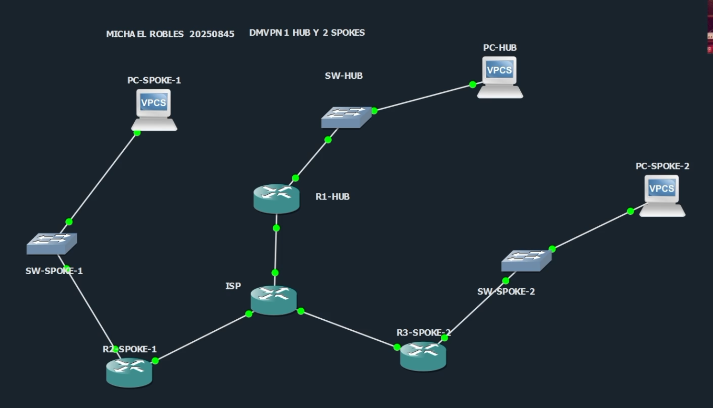
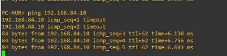
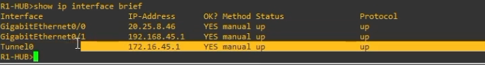
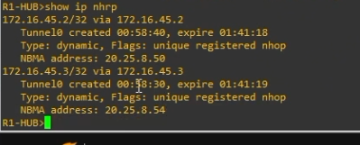
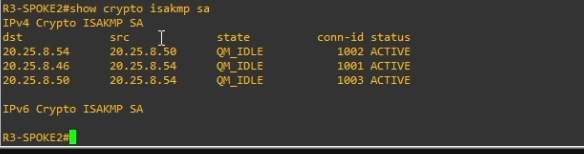
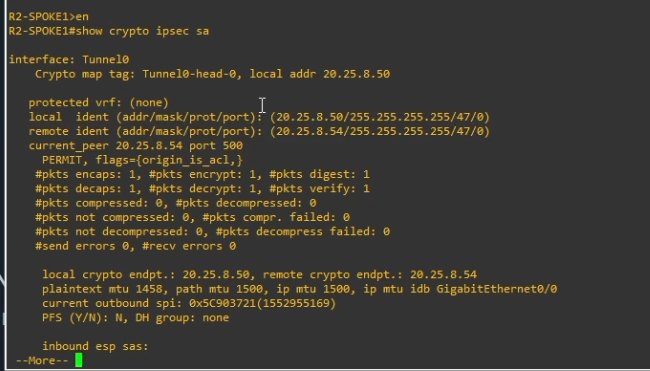
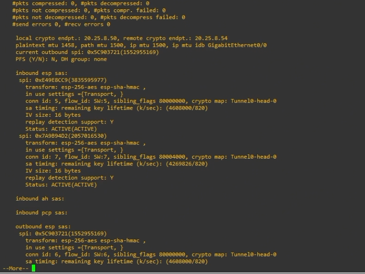
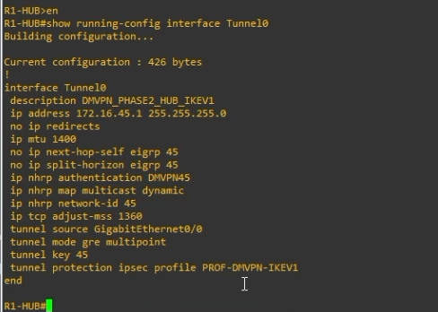

# DMVPN Hub and Spoke Fase 2 con IKEv1 y EIGRP

<p align="center">
  
  
  
  
  
  
</p>

---

## Información del proyecto

**Autor:** Michael David Robles Fermín  
**Matrícula:** 2025-0845  
**Asignatura:** Seguridad de Redes  
**Repositorio:** https://github.com/iClexi/DMVP-Hub-Spoke-IKEv1-Phase-2  
**Video demostrativo:** https://youtu.be/W1ePrYkyxNs  

**Tipo de VPN configurada:** DMVPN Hub and Spoke punto a multipunto, Fase 2, con IKEv1 y enrutamiento dinámico mediante EIGRP.

---

## Índice

- [Descripción general](#descripción-general)
- [Objetivo del laboratorio](#objetivo-del-laboratorio)
- [Topología implementada](#topología-implementada)
- [Direccionamiento IP](#direccionamiento-ip)
- [VLANs utilizadas](#vlans-utilizadas)
- [Parámetros de la VPN](#parámetros-de-la-vpn)
- [Explicación de la configuración](#explicación-de-la-configuración)
- [Scripts de configuración](#scripts-de-configuración)
- [Evidencias de funcionamiento](#evidencias-de-funcionamiento)
- [Comandos de verificación](#comandos-de-verificación)
- [Estructura del repositorio](#estructura-del-repositorio)
- [Conclusión](#conclusión)

---

## Descripción general

Este laboratorio implementa una VPN **DMVPN Fase 2** con diseño **Hub and Spoke**. La topología cuenta con un router central llamado **R1-HUB**, dos routers remotos llamados **R2-SPOKE1** y **R3-SPOKE2**, y un router **ISP** que simula la red pública.

La VPN permite que las tres LAN privadas se comuniquen entre sí de forma segura. El ISP solamente da conectividad WAN entre los routers, pero no participa en el cifrado ni conoce las rutas internas de las LAN privadas.

En esta práctica se utiliza:

- **DMVPN** para crear una nube VPN dinámica multipunto.
- **GRE multipunto** para permitir varios peers en una misma interfaz Tunnel.
- **NHRP** para resolver dinámicamente la relación entre IP de túnel e IP WAN.
- **IKEv1/IPsec** para proteger el tráfico.
- **EIGRP** para el aprendizaje dinámico de rutas entre las LANs.

---

## Objetivo del laboratorio

El objetivo principal es configurar y demostrar una VPN **Hub and Spoke punto a multipunto DMVPN Fase 2 con IKEv1 y enrutamiento dinámico**.

Para cumplirlo se implementó:

- Un router **Hub** central.
- Dos routers **Spokes**.
- Un router **ISP** como red pública simulada.
- Una LAN detrás de cada peer DMVPN.
- Switches Cisco IOSvL2 para representar cada red local.
- Cifrado mediante **IKEv1/IPsec**.
- Túneles **GRE multipunto**.
- Registro y resolución mediante **NHRP**.
- Enrutamiento dinámico mediante **EIGRP proceso 45**.
- Verificación de conectividad Hub-to-Spoke y Spoke-to-Spoke.

---

## Topología implementada

La topología fue montada en GNS3 usando routers Cisco, switches IOSvL2 y VPCS.

<p align="center">
  
</p>

**Figura 1. Topología general DMVPN Hub and Spoke con 1 Hub y 2 Spokes.**

La distribución lógica es la siguiente:

```text
PC-HUB ---- SW-HUB ---- R1-HUB ---- ISP ---- R2-SPOKE1 ---- SW-SPOKE1 ---- PC-SPOKE1
                              \
                               \---- R3-SPOKE2 ---- SW-SPOKE2 ---- PC-SPOKE2
```

### Conexiones físicas principales

| Desde | Interfaz | Hacia | Interfaz |
|---|---:|---|---:|
| PC-HUB | e0 | SW-HUB | Gi0/1 |
| SW-HUB | Gi0/0 | R1-HUB | Gi0/1 |
| R1-HUB | Gi0/0 | ISP | Gi0/0 |
| ISP | Gi0/1 | R2-SPOKE1 | Gi0/0 |
| R2-SPOKE1 | Gi0/1 | SW-SPOKE1 | Gi0/0 |
| SW-SPOKE1 | Gi0/1 | PC-SPOKE1 | e0 |
| ISP | Gi0/2 | R3-SPOKE2 | Gi0/0 |
| R3-SPOKE2 | Gi0/1 | SW-SPOKE2 | Gi0/0 |
| SW-SPOKE2 | Gi0/1 | PC-SPOKE2 | e0 |

---

## Direccionamiento IP

### Red WAN / ISP

| Dispositivo | Interfaz | Dirección IP | Descripción |
|---|---:|---:|---|
| ISP | Gi0/0 | 20.25.8.45/30 | Enlace hacia R1-HUB |
| R1-HUB | Gi0/0 | 20.25.8.46/30 | WAN del Hub |
| ISP | Gi0/1 | 20.25.8.49/30 | Enlace hacia R2-SPOKE1 |
| R2-SPOKE1 | Gi0/0 | 20.25.8.50/30 | WAN del Spoke 1 |
| ISP | Gi0/2 | 20.25.8.53/30 | Enlace hacia R3-SPOKE2 |
| R3-SPOKE2 | Gi0/0 | 20.25.8.54/30 | WAN del Spoke 2 |

### Redes LAN

| Sitio | Gateway | PC | Red |
|---|---:|---:|---:|
| Hub | 192.168.45.1 | 192.168.45.10 | 192.168.45.0/24 |
| Spoke 1 | 192.168.84.1 | 192.168.84.10 | 192.168.84.0/24 |
| Spoke 2 | 192.168.58.1 | 192.168.58.10 | 192.168.58.0/24 |

### Red de túnel DMVPN

| Router | Interfaz | IP de túnel |
|---|---:|---:|
| R1-HUB | Tunnel0 | 172.16.45.1/24 |
| R2-SPOKE1 | Tunnel0 | 172.16.45.2/24 |
| R3-SPOKE2 | Tunnel0 | 172.16.45.3/24 |

---

## VLANs utilizadas

Los switches IOSvL2 fueron usados para representar las LANs de cada sitio. Cada LAN fue colocada en una VLAN separada.

| Switch | VLAN | Nombre | Uso |
|---|---:|---|---|
| SW-HUB | 45 | LAN_HUB | Red local del Hub |
| SW-SPOKE1 | 84 | LAN_SPOKE1 | Red local del Spoke 1 |
| SW-SPOKE2 | 58 | LAN_SPOKE2 | Red local del Spoke 2 |

Los switches no participan en la VPN. Su función es únicamente conectar la PC local con el router de su sitio.

---

## Parámetros de la VPN

| Parámetro | Valor |
|---|---|
| Tipo de VPN | DMVPN Hub and Spoke |
| Fase DMVPN | Fase 2 |
| Modelo | Punto a multipunto |
| Router Hub | R1-HUB |
| Routers Spokes | R2-SPOKE1 y R3-SPOKE2 |
| Protocolo de seguridad | IKEv1/IPsec |
| Clave precompartida | ITLA20250845 |
| Transform-set | TS-DMVPN-IKEV1 |
| Perfil IPsec | PROF-DMVPN-IKEV1 |
| Cifrado | AES 256 |
| Integridad | SHA-HMAC |
| Modo IPsec | Transport |
| Túnel | GRE multipunto |
| Red DMVPN | 172.16.45.0/24 |
| NHRP Network-ID | 45 |
| Autenticación NHRP | DMVPN45 |
| Enrutamiento dinámico | EIGRP |
| Proceso EIGRP | 45 |

---

## Explicación de la configuración

### 1. Diseño Hub and Spoke

El diseño **Hub and Spoke** usa un router central llamado Hub y varios routers remotos llamados Spokes. En este laboratorio, **R1-HUB** funciona como punto central de registro NHRP, mientras que **R2-SPOKE1** y **R3-SPOKE2** se registran contra el Hub.

El Hub permite que los Spokes conozcan la nube DMVPN. Sin embargo, como se usa **DMVPN Fase 2**, los Spokes también pueden comunicarse directamente entre ellos cuando necesitan enviar tráfico entre sus LANs.

### 2. VPN punto a multipunto

La VPN es punto a multipunto porque no se creó un túnel separado por cada par de routers. En vez de eso, cada router usa una única interfaz **Tunnel0** con `tunnel mode gre multipoint`.

Esto permite que la misma nube DMVPN soporte múltiples routers al mismo tiempo.

### 3. DMVPN Fase 2

En **DMVPN Fase 2**, el Hub ayuda con el registro inicial y con el aprendizaje de rutas, pero el tráfico entre Spokes puede viajar directamente.

La evidencia más importante de Fase 2 es que **R2 aprende la LAN de R3 usando como next-hop 172.16.45.3**, y **R3 aprende la LAN de R2 usando como next-hop 172.16.45.2**.

En el Hub se configuraron estos comandos clave:

```cisco
no ip split-horizon eigrp 45
no ip next-hop-self eigrp 45
```

`no ip split-horizon eigrp 45` permite que el Hub anuncie a un Spoke rutas aprendidas desde otro Spoke.

`no ip next-hop-self eigrp 45` evita que el Hub se coloque como siguiente salto, permitiendo que el next-hop se mantenga como el Spoke remoto.

### 4. IKEv1 e IPsec

IKEv1 negocia los parámetros de seguridad iniciales entre los routers. En este laboratorio se configuró AES 256, SHA, autenticación por clave precompartida, Diffie-Hellman grupo 5 y lifetime de 86400 segundos.

```cisco
crypto isakmp policy 10
 encr aes 256
 hash sha
 authentication pre-share
 group 5
 lifetime 86400
```

La clave precompartida usada por todos los routers fue:

```cisco
crypto isakmp key ITLA20250845 address 0.0.0.0 0.0.0.0
```

IPsec protege el tráfico real que pasa por el túnel GRE. Para eso se creó un transform-set y un perfil IPsec:

```cisco
crypto ipsec transform-set TS-DMVPN-IKEV1 esp-aes 256 esp-sha-hmac
 mode transport

crypto ipsec profile PROF-DMVPN-IKEV1
 set transform-set TS-DMVPN-IKEV1
```

El perfil se aplica directamente sobre `Tunnel0`:

```cisco
tunnel protection ipsec profile PROF-DMVPN-IKEV1
```

### 5. NHRP

NHRP permite que los routers relacionen la IP lógica del túnel con la IP WAN real.

En R1-HUB se acepta registro dinámico de los Spokes:

```cisco
ip nhrp map multicast dynamic
ip nhrp network-id 45
```

En los Spokes se apunta manualmente hacia el Hub:

```cisco
ip nhrp map 172.16.45.1 20.25.8.46
ip nhrp map multicast 20.25.8.46
ip nhrp nhs 172.16.45.1
```

Esto indica que el servidor NHRP es R1-HUB, cuya IP de túnel es `172.16.45.1` y cuya IP WAN real es `20.25.8.46`.

### 6. EIGRP

EIGRP se configuró para anunciar dinámicamente las LANs de cada sitio.

```cisco
router eigrp 45
 no auto-summary
 network 172.16.45.0 0.0.0.255
 network 192.168.X.0 0.0.0.255
 passive-interface GigabitEthernet0/1
```

La red `172.16.45.0/24` permite formar vecinos EIGRP sobre el túnel DMVPN. La red LAN de cada router se anuncia para que las demás sedes puedan alcanzarla.

La interfaz LAN se configuró como pasiva porque ahí solo hay PCs y switches, no routers vecinos EIGRP.

---

## Scripts de configuración

Los scripts completos se encuentran en la carpeta [`scripts/`](scripts/).

| Dispositivo | Archivo | Qué configura |
|---|---|---|
| R1-HUB | [`scripts/R1-HUB.txt`](scripts/R1-HUB.txt) | Router Hub, IKEv1, IPsec, NHRP dinámico, GRE multipunto y EIGRP |
| R2-SPOKE1 | [`scripts/R2-SPOKE1.txt`](scripts/R2-SPOKE1.txt) | Spoke 1, IKEv1, IPsec, NHRP hacia el Hub, GRE multipunto y EIGRP |
| R3-SPOKE2 | [`scripts/R3-SPOKE2.txt`](scripts/R3-SPOKE2.txt) | Spoke 2, IKEv1, IPsec, NHRP hacia el Hub, GRE multipunto y EIGRP |
| ISP | [`scripts/ISP.txt`](scripts/ISP.txt) | Enlaces WAN entre R1, R2 y R3 |
| SW-HUB | [`scripts/SW-HUB.txt`](scripts/SW-HUB.txt) | VLAN 45 y puertos access hacia R1 y PC-HUB |
| SW-SPOKE1 | [`scripts/SW-SPOKE1.txt`](scripts/SW-SPOKE1.txt) | VLAN 84 y puertos access hacia R2 y PC-SPOKE1 |
| SW-SPOKE2 | [`scripts/SW-SPOKE2.txt`](scripts/SW-SPOKE2.txt) | VLAN 58 y puertos access hacia R3 y PC-SPOKE2 |
| PC-HUB | [`scripts/PC-HUB.txt`](scripts/PC-HUB.txt) | IP estática y gateway de PC-HUB |
| PC-SPOKE1 | [`scripts/PC-SPOKE1.txt`](scripts/PC-SPOKE1.txt) | IP estática y gateway de PC-SPOKE1 |
| PC-SPOKE2 | [`scripts/PC-SPOKE2.txt`](scripts/PC-SPOKE2.txt) | IP estática y gateway de PC-SPOKE2 |

### Diferencia entre el script del Hub y los Spokes

R1-HUB contiene la configuración propia del Hub:

```cisco
ip nhrp map multicast dynamic
no ip split-horizon eigrp 45
no ip next-hop-self eigrp 45
```

R2 y R3 contienen la configuración propia de Spoke:

```cisco
ip nhrp map 172.16.45.1 20.25.8.46
ip nhrp map multicast 20.25.8.46
ip nhrp nhs 172.16.45.1
```

La parte de IKEv1, IPsec, transform-set, perfil IPsec y EIGRP mantiene la misma lógica en los tres routers para que puedan formar la nube DMVPN.

---

## Evidencias de funcionamiento

### 1. Topología general

<p align="center">
  
</p>

Esta evidencia muestra la topología completa en GNS3 con nombre, matrícula, router Hub, dos Spokes, un ISP, tres switches y tres PCs.

---

### 2. Ping desde PC-HUB hacia PC-SPOKE1

<p align="center">
  
</p>

La prueba muestra conectividad desde **PC-HUB** hacia **PC-SPOKE1** usando la IP `192.168.84.10`. Los primeros paquetes pueden fallar mientras DMVPN, NHRP e IPsec terminan de negociar, pero luego el ping responde correctamente.

---

### 3. Interfaces activas en R1-HUB

<p align="center">
  
</p>

El comando `show ip interface brief` confirma que R1 tiene activas sus interfaces principales:

- `GigabitEthernet0/0`: WAN hacia ISP.
- `GigabitEthernet0/1`: LAN hacia SW-HUB.
- `Tunnel0`: interfaz lógica de la VPN DMVPN.

---

### 4. Tabla NHRP en R1-HUB

<p align="center">
  
</p>

El comando `show ip nhrp` en R1-HUB muestra que los Spokes se registraron correctamente:

- `172.16.45.2` corresponde a R2-SPOKE1.
- `172.16.45.3` corresponde a R3-SPOKE2.

Esto confirma que NHRP está funcionando y que el Hub reconoce a los Spokes dentro de la nube DMVPN.

---

### 5. Estado IKEv1 en R3-SPOKE2

<p align="center">
  
</p>

El comando `show crypto isakmp sa` muestra el estado `QM_IDLE`, lo cual indica que la negociación IKEv1 fue completada correctamente y las asociaciones de seguridad están activas.

---

### 6. Estado IPsec en R2-SPOKE1

<p align="center">
  
</p>

Esta evidencia muestra la salida de `show crypto ipsec sa` en R2-SPOKE1. Se observa que el tráfico está protegido por IPsec sobre `Tunnel0`.

---

### 7. Detalle de SA entrantes y salientes

<p align="center">
  
</p>

Aquí se observan las SAs de IPsec en estado `ACTIVE`. Esto confirma que existen asociaciones entrantes y salientes para proteger el tráfico de la VPN.

---

### 8. Configuración de Tunnel0 en R1-HUB

<p align="center">
  
</p>

La salida de `show running-config interface Tunnel0` evidencia los comandos principales de DMVPN Fase 2:

- IP de túnel `172.16.45.1/24`.
- `ip nhrp map multicast dynamic`.
- `no ip split-horizon eigrp 45`.
- `no ip next-hop-self eigrp 45`.
- `tunnel mode gre multipoint`.
- `tunnel protection ipsec profile PROF-DMVPN-IKEV1`.

---

## Comandos de verificación

### Verificar interfaces

```cisco
show ip interface brief
```

### Verificar DMVPN

```cisco
show dmvpn
show dmvpn detail
```

### Verificar NHRP

```cisco
show ip nhrp
```

### Verificar IKEv1

```cisco
show crypto isakmp sa
```

El estado esperado es:

```text
QM_IDLE
```

### Verificar IPsec

```cisco
show crypto ipsec sa
```

Se deben revisar los contadores:

```text
#pkts encaps
#pkts decaps
```

Si estos contadores aumentan después de hacer ping, significa que el tráfico está siendo cifrado y descifrado por IPsec.

### Verificar EIGRP

```cisco
show ip eigrp neighbors
show ip route eigrp
```

### Verificar comportamiento Fase 2

En R2-SPOKE1:

```cisco
show ip route 192.168.58.0
```

La ruta hacia la LAN de R3 debe aparecer vía:

```text
172.16.45.3
```

En R3-SPOKE2:

```cisco
show ip route 192.168.84.0
```

La ruta hacia la LAN de R2 debe aparecer vía:

```text
172.16.45.2
```

Esto demuestra comunicación **Spoke-to-Spoke** directa a nivel de next-hop, comportamiento esperado en DMVPN Fase 2.

### Pings finales

```bash
PC-HUB> ping 192.168.84.10
PC-HUB> ping 192.168.58.10
PC-SPOKE1> ping 192.168.58.10
PC-SPOKE2> ping 192.168.84.10
```

---

## Estructura del repositorio

```text
DMVP-Hub-Spoke-IKEv1-Phase-2/
│
├── README.md
├── Links_Video_Repositorio.txt
│
├── docs/
│   ├── Documentacion_Tecnica_Profesional_DMVPN_Fase2_IKEv1.docx
│   └── Documentacion_Tecnica_Profesional_DMVPN_Fase2_IKEv1.pdf
│
├── images/
│   ├── 01_topologia_general.png
│   ├── 02_ping_pc_hub_a_pc_spoke1.png
│   ├── 03_r1_show_ip_interface_brief.png
│   ├── 04_r1_show_ip_nhrp.png
│   ├── 05_r3_show_crypto_isakmp_sa.png
│   ├── 06_r2_show_crypto_ipsec_sa_parte1.png
│   ├── 07_r2_show_crypto_ipsec_sa_parte2.png
│   └── 08_r1_show_running_config_tunnel0.png
│
└── scripts/
    ├── ISP.txt
    ├── PC-HUB.txt
    ├── PC-SPOKE1.txt
    ├── PC-SPOKE2.txt
    ├── R1-HUB.txt
    ├── R2-SPOKE1.txt
    ├── R3-SPOKE2.txt
    ├── SW-HUB.txt
    ├── SW-SPOKE1.txt
    └── SW-SPOKE2.txt
```

---

## Conclusión

Con este laboratorio se logró configurar una VPN **DMVPN Fase 2 Hub and Spoke** usando **IKEv1/IPsec** y **EIGRP**. La topología permite que las LANs detrás de R1, R2 y R3 se comuniquen de forma segura a través del ISP.

Las evidencias demuestran que:

- Las interfaces físicas y Tunnel0 están activas.
- Los Spokes se registran correctamente en el Hub mediante NHRP.
- IKEv1 negocia correctamente en estado `QM_IDLE`.
- IPsec crea asociaciones de seguridad activas.
- EIGRP aprende las redes LAN remotas.
- Existe comunicación entre Hub y Spokes.
- Existe comunicación Spoke-to-Spoke, cumpliendo el comportamiento esperado de **DMVPN Fase 2**.
